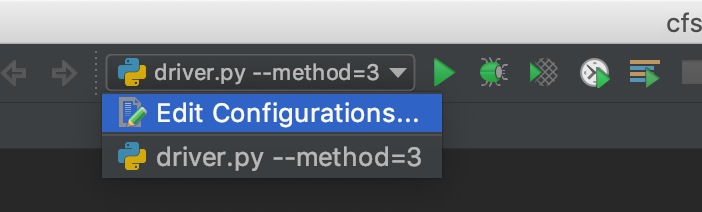
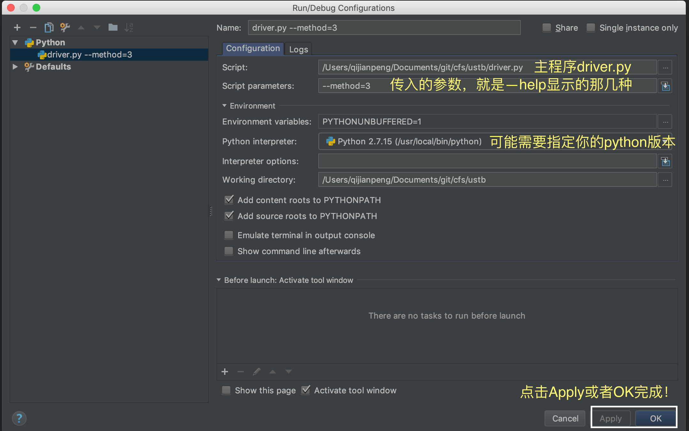

# Collaborative-Filtering-System
Collaborative Filtering System

包含两类：User-based与Item-based.

- **User-based**:
1. 按照用户访问记录加权的协同过滤算法个性化电影推荐系统. `python driver.py --method=1`
2. 按照用户评价加权的协同过滤算法个性化电影推荐系统. `python driver.py --method=2`
      相似度计算可选方式：1, Cosine. 2, Pearson. 3, Jaccard
3. 基于NMF非负矩阵分解的推荐算法个性化电影推荐系统. `python driver.py --method=3`
4. 基于Baseline的推荐算法个性化电影推荐系统. `python driver.py --method=4`

- **Item-based**:（适合用户多，Item少的情况。慎选，当前测试集集包含Item较多，计算复杂度为M^3，本Demo约为3分钟）
5. 基于Item评分的协同过滤算法个性化电影推荐系统. `python driver.py --method=5`
      相似度计算可选方式：1, Cosine. 2, Pearson. 3, Jaccard


# Usages
Try: `python driver.py --help` on your command line to see what happens!

# Requirements:
- Python 2.7
- Pandas # 数据的ETL
- numpy # 矩阵计算
- scipy # 一些相似度使用的公式，如cosine，Pearson等
- argparse # 传入参数解析

# Developments
0. **Clone Projects to your local.**
```bash
git clone git@github.com:qijianpeng/Collaborative-Filtering-System.git cfs
```

1. **For PyCharm**

 - 本项目包含目录`.idea`, 已对`sources`及`library`进行添加，可直接打开PyCharm选择导入项目.（Thanks 尚秀同学发现问题～）
 - Debug 环境：已经默认添加了`python --method=3` nmf方法，其他可以类似仿照, 步骤如下：
  1. 选择Edit Configurations:
    
  2. 点击弹出窗口左上角+号，Add New Configurations, 按照如下方式配置：
    

2. **For Others**

 VIM直接进行编辑即可.


# TODO LISTS
- :hushed: Evaluator: We need evaluation method(s) to test the result.
    1. Regularizate results of differents CF methods.
    2. Evaluate all the results but not a single user for CF methods.
- :wink: 《Recommender Systems Handbook》 lists many interesting methods, 
  Item-based, User-based are all in Chaptor 4: A Comprehensive Survey of Neighborhodd-based
  Recommendation Methods. 2 categories are not enough to understand RS. Here is
  a short todo lists:
  1. Content-based methods
  2. Chaptor 5: Advances in Collaborative Filtering.

# Feedback
Just open an issue, we'll reply A.S.A.P.

:beers:

